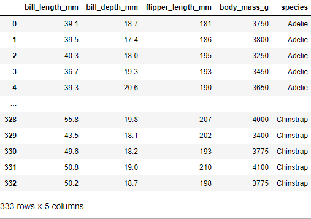
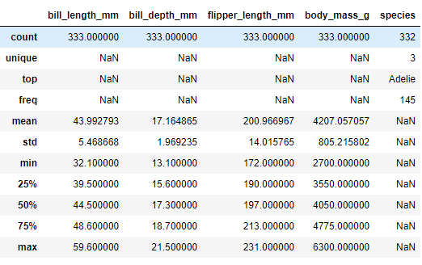
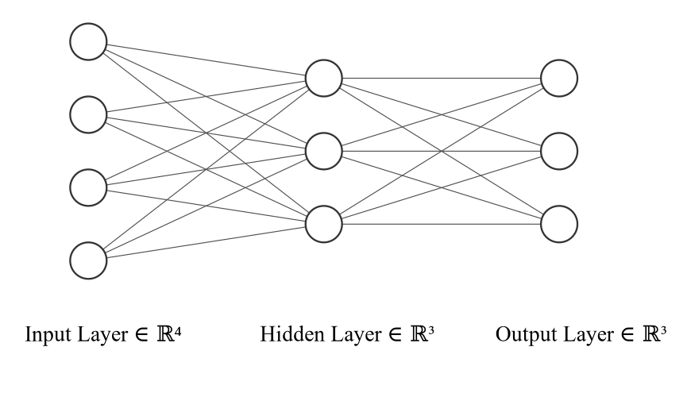
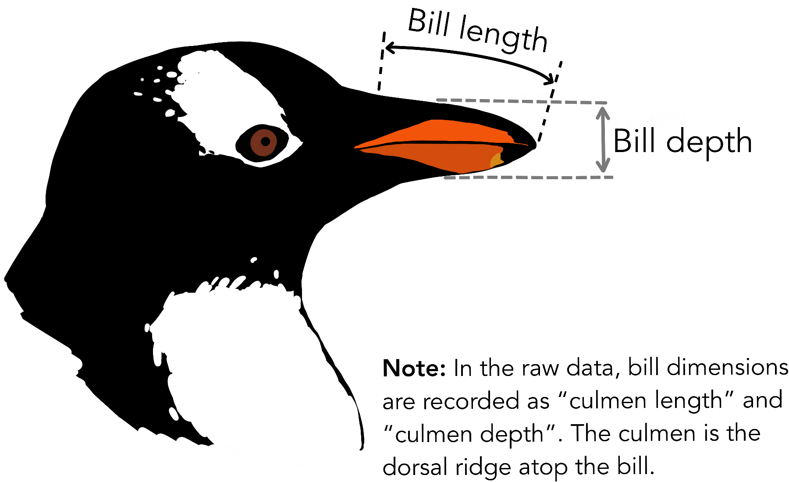

# Red Neuronal Multicapa en Go

## Dataset

El dataset utilizado se llama `penguins`, y se trata de una versión simplificada del dataset original `Palmer Archipelago (Antarctica) penguin data`. Esta versión se puede generar en la subcarpeta data/ del proyecto. La versión completa del dataset original está disponible [Aquí](https://github.com/allisonhorst/palmerpenguins)

``` r
head(penguins)
#> # A tibble: 6 x 8
#>   species island bill_length_mm bill_depth_mm flipper_length_… body_mass_g sex  
#>   <fct>   <fct>           <dbl>         <dbl>            <int>       <int> <fct>
#> 1 Adelie  Torge…           39.1          18.7              181        3750 male 
#> 2 Adelie  Torge…           39.5          17.4              186        3800 fema…
#> 3 Adelie  Torge…           40.3          18                195        3250 fema…
#> 4 Adelie  Torge…           NA            NA                 NA          NA <NA> 
#> 5 Adelie  Torge…           36.7          19.3              193        3450 fema…
#> 6 Adelie  Torge…           39.3          20.6              190        3650 male 
#> # … with 1 more variable: year <int>
```

### Procesamiento de dataset

Se ha utilizado una versión personalizada del dataset. Editada para la predecir la clasificación de pingüinos según su especie a partir de cuatro atributos numéricos del dataset (longitud de pico, altura de pico, longitud de aleta y masa corporal)

El dataset utilizado tiene la siguiente estructura:



Tiene también las siguientes características:



El formato de dataset utilizado se muestra a continuación. Se usa la codificación **One-hot** para convertir datos categóricos (la especie) en datos numéricos para su procesamiento y uso en la red neuronal.


## Arquitectura



Una red neuronal multicapa simple que consiste en una capa de entrada, una oculta y una de salida. Los cuatro nodos de la capa de entrada corresponden a los cuatro atributos utilizados del dataset. Asimismo, las demás capas tienen 3 nodos ya que el dataset tiene 3 clasificaciones únicas para las especies de pingüino.


## Uso

Para ejecutar el programa:
```bash
git clone https://github.com/CFSanchezV/MLNetGo.git
cd MLNetGo
go run main.go
```


Para volver a descargar y generar los archivos del dataset (.csv) :

```bash
Desde el directorio raíz:
cd data
go run main.go
```

### Sobre el dataset:

"**bill depth**" y "**bill length**" significan altura de pico y longitud de pico respectivamente

